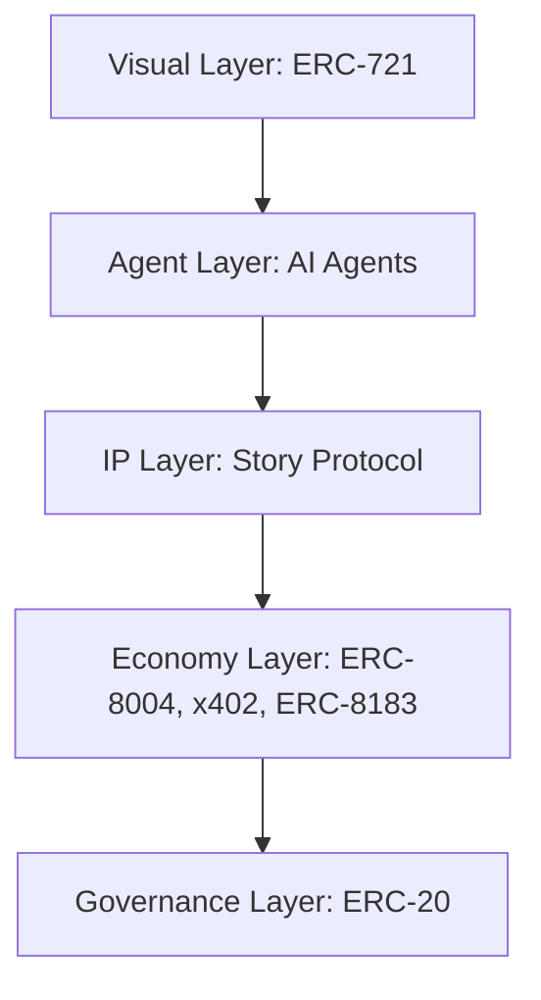

# Future Vanity Fair Club (FVFC)

Official public profile for **Future Vanity Fair Club (FVFC)**.

Future Vanity Fair Club is a digital metropolis built around Vani NFTs, where Future Glam aesthetics, autonomous IP rights, and crypto-native creative infrastructure converge.

FVFC is designed as more than a collectible project. It is an open Living IP economy where 10,000 Vani begin as ERC-721 visual identities and evolve through programmable personas, AI agents, IP licensing, and onchain contribution systems.

## Infrastructure

FVFC is structured around five operational layers:

- **Visual Layer**: ERC-721. Vani's foundational art layer, built from 879 hand-drawn traits through algorithmic generation and human refinement.
- **Agent Layer**: AI agents. Programmable systems that help Vani act, create, and evolve beyond a static asset.
- **IP Layer**: Story Protocol. Infrastructure for programmable creative rights, IP licensing, derivatives, and royalty flows.
- **Economy Layer**: ERC-8004, x402, and ERC-8183. Standards for identity, permissions, payments, coordination, creator contributions, and IP-based rewards.
- **Governance Layer**: ERC-20. The future token layer for value exchange, contributor incentives, and decentralized governance participation.

## Future Glam

FVFC's visual language is **Future Glam**: a cyber-luxury aesthetic shaped by high-fashion illustration, iridescent gradients, diamonds, digital currency, sci-fi motifs, and playful hedonism.

Each Vani is a one-of-one digital fashion portrait. The collection is crafted from 879 hand-drawn attributes, 2,000+ algorithmic rules, and a rigorous selection process from approximately 3 million candidates.

## Navigation

- Website: https://futurevanityfairclub.vercel.app
- Vani: https://futurevanityfairclub.vercel.app/vani
- Aesthetic: https://futurevanityfairclub.vercel.app/aesthetic
- Process: https://futurevanityfairclub.vercel.app/process
- Infrastructure: https://futurevanityfairclub.vercel.app/infrastructure
- Attributes: https://futurevanityfairclub.vercel.app/attributes
- Gallery: https://futurevanityfairclub.vercel.app/gallery
- License: https://futurevanityfairclub.vercel.app/license
- About FVFC: https://futurevanityfairclub.vercel.app/fvfc

## Buy

- Mint: https://futurevanityfairclub.vercel.app/mint
- OpenSea: https://opensea.io
- Magic Eden: https://magiceden.io
- Blur: https://blur.io

## Socials

- X: https://x.com/future_vanity
- Bluesky: https://bsky.app/profile/futurevanity.bsky.social
- Instagram: https://www.instagram.com/future_vanity/
- Threads: https://www.threads.com/@future_vanity
- Facebook: https://www.facebook.com/people/Future-Vanity-Fair-Club/61583735787299/
- Zora: https://zora.co/@fvfc
- Discord: https://discord.gg/Dwpk2vXpZD
- Telegram: https://t.me/FutureVanityFairClub
- Reddit: https://www.reddit.com/r/futurevanityfairclub/
- Substack: https://substack.com/@futurevanity
- Pinterest: https://www.pinterest.com/futurevanity/
- Medium: https://medium.com/@futurevanity
- GitHub: https://github.com/futurevanityfairclub
- TikTok: https://www.tiktok.com/@future_vanity

## Notes

- The main website code repository is private.
- This public repository exists to provide an official profile, brand presence, and public contact points.
- For holder rights, commercial usage, and IP framework details, see the official License page.
