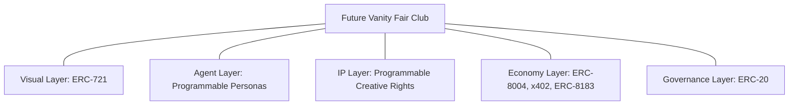

  

# Future Vanity Fair Club (FVFC)

> Welcome to **Future Vanity Fair Club (FVFC)**. Born of beauty and desire, 10,000 Vani awaken as founding residents of Future City. Built on high-fashion art, AI, and crypto, FVFC creates a decentralized agentic IP economy. Every Vani begins as a foundational portrait, designed to become a Living IP through her programmable persona.
>
> Vani follows a distinctive aesthetic called **"Future Glam,"** a cyber-luxury look defined by iridescent gradients, diamonds, digital currency, sci-fi motifs, and a playful, hedonistic spirit. Built from 881 hand-drawn traits and over 2,000 algorithmic rules through human refinement, each Vani is crafted as one of 10,000 collectible high-fashion portraits selected from about 3 million candidates, with only about 0.33% chosen.

---

## 💎 About The Living IP Economy

**Future Vanity Fair Club (FVFC)** is an open, decentralized Living IP economy built in Future City. It combines high-fashion art, AI, and crypto where 10,000 Vani NFTs live, create, earn, and grow through their programmable personas.

- **Living IP**: The NFT serves as her visual foundation, while her programmable persona evolves through dynamic modules for identity, talents, wealth, and fame, actively shaping the growth of the club.
- **Decentralized IP Licensing**: Moving beyond closed corporate models to decentralized IP protocols where creators, developers, and holders collaborate under clear programmable licensing and automated IP-based rewards.
- **Agentic IP Economy**: Built on smart contracts and autonomous workflows, AI agents handle business workflows, agent-to-agent payments, automated licensing, and contribution verification, allowing the IP to scale organically.

---

## ✨ Artistic Craftsmanship

The creation of FVFC represents over two years of artisanal craftsmanship, high-fashion illustration, and algorithmic curation:

- **4,000 × 4,000 Resolution**: Each original artwork is created and stored at **4,000 × 4,000 pixels**, suitable for digital displays and physical printing.
- **Hand-drawn Art**: **881 unique elements** across **16 primary trait categories**, stacked across **40 independent visual layers**.
- **Algorithmic Logic**: **2,000+ combination rules** (each governed by 10 to 20 sub-conditions) refined over **100+ iterative cycles**, ensuring an average attribute difference of **over 93%**.
- **Curated Selection**: The collection of **10,000 Vani NFTs** was curated and refined through a multi-stage selection process from approximately **3 million generated candidate images** (~0.33% selection rate).
- **Future Glam**: Cyber-luxury visual language blending modern chic with iridescent gradients, diamonds, digital currency, sci-fi motifs, and 4 signature looks (*Ivory, Bronze, Chocolate, and Luminous*).
- **Rarity Whitepaper & Dataset**: Explore the complete [FVFC Trait Rarity Whitepaper](docs/rarity/FVFC_NFT_Rarity_Whitepaper.md) and download the [881-Trait Dataset (CSV)](docs/rarity/FVFC_Trait_Rarity_Dataset.csv).

---

## 🪩 5-Layer Infrastructure Framework

The website presents FVFC through five conceptual architectural layers. The live mint currently covers Vani's **Visual Layer** as static ERC-721 artwork; programmable persona, agent, IP, economy, and governance layers are future architectural components that may evolve as technology develops:

```mermaid
graph TD
    FVFC[Future Vanity Fair Club]
    FVFC --- A[Visual Layer: ERC-721]
    FVFC --- B[Agent Layer: Programmable Personas]
    FVFC --- C[IP Layer: Programmable Creative Rights]
    FVFC --- D[Economy Layer: ERC-8004, x402, ERC-8183]
    FVFC --- E[Governance Layer: ERC-20]
```

- **Visual Layer (Live)**: ERC-721 standard on Ethereum mainnet, built on Thirdweb's audited smart contracts with 4,000 × 4,000 high-resolution artwork and metadata on IPFS and Filecoin mainnet. Combining 881 hand-drawn traits with algorithmic curation, this genesis layer is Vani’s visual foundation and the collectible base for all subsequent layers.
- **Agent Layer (Future)**: Programmable Personas introduce dynamic modules for identity, talents, wealth, and fame, enabling Vani to expand her storytelling and capabilities as a Living IP.
- **IP Layer (Future)**: Programmable Creative Rights. Powers Vani's decentralized IP infrastructure by managing programmable licensing, derivative creations, automated royalty flows, and on-chain provenance.
- **Economy Layer (Future)**: Built on Base (Layer 2), ERC-8004, x402, and ERC-8183 govern the identity, permissions, payments, and coordination that transform Vani into a living IP economy. Together, they facilitate creator contributions and IP-based rewards.
- **Governance Layer (Future)**: ERC-20. Designed as the native token for FVFC. It enables contributor incentives, ecosystem value exchange, and decentralized governance participation.

---

## 📜 Smart Contracts & Decentralized Storage

Official smart contracts, decentralized storage, and media distribution infrastructure deployed on Ethereum, Filecoin Mainnet, and Cloudflare Global Edge:

| Resource | Protocol / Network | Contract / Storage Identifier | Live Verification / Manifest |
| :--- | :---: | :--- | :--- |
| **Future Vanity Fair Club (FVFC)** | `ERC-721` (Ethereum) | [`0xcA32FA34ef54B6F69dC08fa401a911F7Dd3dD9cb`](https://etherscan.io/address/0xcA32FA34ef54B6F69dC08fa401a911F7Dd3dD9cb) | [Etherscan Explorer](https://etherscan.io/address/0xcA32FA34ef54B6F69dC08fa401a911F7Dd3dD9cb) |
| **NFT Metadata (10,000 JSON)** | `IPFS` / `Filecoin` | [`ipfs://bafybeifeknbufooufuwsg7v4zalwcvlkyruje4mkqjkm5s5vvuzqnmf77a/`](https://media.futurevanityfairclub.workers.dev/ipfs/bafybeifeknbufooufuwsg7v4zalwcvlkyruje4mkqjkm5s5vvuzqnmf77a/) | [`View 10k Metadata Root`](https://media.futurevanityfairclub.workers.dev/ipfs/bafybeifeknbufooufuwsg7v4zalwcvlkyruje4mkqjkm5s5vvuzqnmf77a/) |
| **Artwork Storage (4,000 × 4,000)** | `IPFS` / `Filecoin` | [54 CAR Packages (50.6 GB Vani Artworks)](https://github.com/futurevanityfairclub/futurevanityfairclub/blob/main/PROVENANCE.md) | [PROVENANCE Manifest](https://github.com/futurevanityfairclub/futurevanityfairclub/blob/main/PROVENANCE.md) |
| **Rarity Whitepaper & Dataset** | `Documentation` | 881 Trait Dataset & Classification | [Whitepaper](docs/rarity/FVFC_NFT_Rarity_Whitepaper.md) / [Dataset (CSV)](docs/rarity/FVFC_Trait_Rarity_Dataset.csv) |
| **Global Media Gateway** | `Cloudflare Edge` | `media.futurevanityfairclub.workers.dev` | [`Gateway Health Check`](https://media.futurevanityfairclub.workers.dev/health) |

---

## ⚡ Web Application Technology Stack

- **Frontend Core**: Next.js 16 (App Router), React 19, TypeScript
- **Styling & Motion**: Tailwind CSS, Framer Motion, Radix UI, Phosphor Icons, Lucide
- **Web3 & Contracts**: Thirdweb SDK v5, Viem, 0xSplits Protocol (Splits Warehouse v2)
- **Decentralized Storage & Media CDN**: Filecoin Network (Mainnet), IPFS, Cloudflare Workers Global Edge Media Gateway (with 1-year immutable caching)
- **Reliability & Monitoring**: Automated Health & Media Probes, Upstash KV / Redis, Checkly Synthetic Monitoring, Telegram Ops Notification Bridge

---

## 🏙️ Official Navigation

All links are strictly aligned with the official website navigation structure:

- **Home**: [https://futurevanityfairclub.com](https://futurevanityfairclub.com)
- **Collection**:
  - **IP**:
    - **Vani**: [https://futurevanityfairclub.com/vani](https://futurevanityfairclub.com/vani)
    - **Aesthetic**: [https://futurevanityfairclub.com/aesthetic](https://futurevanityfairclub.com/aesthetic)
  - **Development**:
    - **Craftsmanship**: [https://futurevanityfairclub.com/craftsmanship](https://futurevanityfairclub.com/craftsmanship)
    - **Technology**: [https://futurevanityfairclub.com/technology](https://futurevanityfairclub.com/technology)
    - **Traits**: [https://futurevanityfairclub.com/traits](https://futurevanityfairclub.com/traits)
- **Gallery**: [https://futurevanityfairclub.com/gallery](https://futurevanityfairclub.com/gallery)
- **Buy**:
  - **Official Mint**: [https://futurevanityfairclub.com/mint](https://futurevanityfairclub.com/mint)
  - **OpenSea**: [https://opensea.io](https://opensea.io)
  - **Magic Eden**: [https://magiceden.io](https://magiceden.io)
  - **Blur**: [https://blur.io](https://blur.io)
- **License**: [https://futurevanityfairclub.com/license](https://futurevanityfairclub.com/license)
- **FAQ**: [https://futurevanityfairclub.com/faq](https://futurevanityfairclub.com/faq)
- **About FVFC**: [https://futurevanityfairclub.com/fvfc](https://futurevanityfairclub.com/fvfc)

---

## 🥂 Official Socials & Communities

- **Feed**:
  - **X (Twitter)**: [@future_vanity](https://x.com/future_vanity)
  - **Bluesky**: [futurevanity.bsky.social](https://bsky.app/profile/futurevanity.bsky.social)
  - **Instagram**: [@future_vanity](https://www.instagram.com/future_vanity/)
  - **Threads**: [@future_vanity](https://www.threads.net/@future_vanity)
  - **Facebook**: [Future Vanity Fair Club](https://www.facebook.com/people/Future-Vanity-Fair-Club/61583735787299/)
- **Community**:
  - **Discord**: [Join Discord](https://discord.gg/Dwpk2vXpZD)
  - **Telegram**: [Join Telegram](https://t.me/FutureVanityFairClub)
  - **Reddit**: [r/futurevanityfairclub](https://www.reddit.com/r/futurevanityfairclub/)
- **Editorial**:
  - **Substack**: [futurevanity.substack.com](https://substack.com/@futurevanity)
  - **Pinterest**: [futurevanity](https://www.pinterest.com/futurevanity/)
  - **Medium**: [futurevanity](https://medium.com/@futurevanity)
- **Build**:
  - **GitHub**: [futurevanityfairclub](https://github.com/futurevanityfairclub)
- **Streams**:
  - **TikTok**: [@future_vanity](https://www.tiktok.com/@future_vanity)

---

## 🔒 License & Proprietary Notice

All rights reserved © 2026 **Future Vanity Fair Club**.

- You own your NFT, but FVFC Labs retains all rights to the underlying intellectual property (IP). For full terms, see the official [License](https://futurevanityfairclub.com/license) page.
- This repository contains proprietary code, creative assets, and digital artwork. Unauthorized copying, modification, distribution, or commercial exploitation is strictly prohibited.
