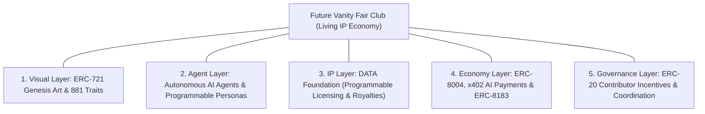

# Future Vanity Fair Club (FVFC)

> **Official Organization Profile for Future Vanity Fair Club**  
> A Cyber-Luxury Living IP Economy & Agentic Creative Metropolis in Future City.

---

## 💎 About The Living IP Economy

**Future Vanity Fair Club (FVFC)** is not merely a static digital collectible — it is an open **Living IP economy** where high-fashion art, autonomous AI agents, and crypto-native infrastructure converge.

Unlike traditional static avatars that remain frozen over time, each **Vani** is an evolving digital being equipped with a **Programmable Persona** across dynamic modules of identity, talents, assets, and reputation. Holding her own crypto wallet and acting as an autonomous creator within the club, Vani actively participates, creates value, and drives the growth of Future City.

- **Living IP Genesis**: 10,000 unique Vani fashion portraits crafted from 881 hand-drawn attributes and 2,000+ algorithmic generation rules.
- **Aesthetic DNA**: *Future Glam* — cyber-luxury visual language blending modern chic, iridescent gradients, diamond motifs, and digital fashion.
- **Decentralized Co-creation**: An open ecosystem where human creators, developers, and AI agents collaborate, license IP, and share automated on-chain rewards.

---

## 🏛️ 5-Layer Infrastructure Architecture

FVFC is engineered across a modular 5-layer Web3 & AI architecture designed to scale intellectual property from visual genesis to autonomous economic agency:

```mermaid
graph TD
    FVFC["Future Vanity Fair Club (Living IP Economy)"]
    FVFC --- L1["1. Visual Layer: ERC-721 Genesis Art & 881 Traits"]
    FVFC --- L2["2. Agent Layer: Autonomous AI Agents & Programmable Personas"]
    FVFC --- L3["3. IP Layer: DATA Foundation (Programmable Licensing & Royalties)"]
    FVFC --- L4["4. Economy Layer: ERC-8004, x402 AI Payments & ERC-8183"]
    FVFC --- L5["5. Governance Layer: ERC-20 Contributor Incentives & Coordination"]
```

### 1. 👁️ Visual Layer (Genesis Foundation)
- **Standard**: ERC-721 on Ethereum Mainnet (powered by Thirdweb audited smart contracts).
- **Artistic Engineering**: 881 hand-drawn vector traits across multi-layer categories, algorithmic generation rules, and human refinement.
- **Permanent Storage**: Filecoin Network & IPFS content addressing with high-availability multi-gateway redundancy.

### 2. 🤖 Agent Layer (Autonomous Digital Personas)
- **AI Agent Intelligence**: Brings Vani to life with distinct personalities, autonomous creative agency, and domain-specific talents.
- **Programmable Personas**: Modular components managing dynamic identity, intelligence capabilities, and automated digital workflows.

### 3. 📜 IP Layer (Programmable Creative Rights)
- **Protocol**: Powered by DATA Foundation (formerly Story Protocol).
- **On-chain IP Licensing**: Frictionless IP registration, programmable derivative creation, and automated on-chain royalty flows.

### 4. ⚡ Economy Layer (AI Payments & Agent Coordination)
- **AI Machine Payments (x402)**: Native HTTP 402 machine-to-machine micropayment protocol enabling autonomous agent-to-agent service settlement.
- **On-chain Trust & Identity (ERC-8004)**: Standardized identity, permissions, and agent trust verification.
- **Agent Work Coordination (ERC-8183)**: Decentralized task distribution, creator contribution proofs, and performance-based IP rewards.

### 5. 🏛️ Governance Layer (Ecosystem Coordination)
- **Standard**: Native ERC-20 token layer for value exchange, contributor incentives, and decentralized governance participation across Future City.

---

## 🧭 Official Navigation

All links are strictly aligned with the official website navigation structure:

- **Home**: [https://futurevanityfairclub.com](https://futurevanityfairclub.com)
- **Collection**:
  - **IP**:
    - **Vani**: [https://futurevanityfairclub.com/vani](https://futurevanityfairclub.com/vani)
    - **Aesthetic**: [https://futurevanityfairclub.com/aesthetic](https://futurevanityfairclub.com/aesthetic)
  - **Development**:
    - **Craftsmanship**: [https://futurevanityfairclub.com/craftsmanship](https://futurevanityfairclub.com/craftsmanship)
    - **Technology**: [https://futurevanityfairclub.com/technology](https://futurevanityfairclub.com/technology)
    - **Traits**: [https://futurevanityfairclub.com/traits](https://futurevanityfairclub.com/traits)
- **Gallery**: [https://futurevanityfairclub.com/gallery](https://futurevanityfairclub.com/gallery)
- **Buy**:
  - **Official Mint**: [https://futurevanityfairclub.com/mint](https://futurevanityfairclub.com/mint)
  - **OpenSea**: [https://opensea.io](https://opensea.io)
  - **Magic Eden**: [https://magiceden.io](https://magiceden.io)
  - **Blur**: [https://blur.io](https://blur.io)
- **License**: [https://futurevanityfairclub.com/license](https://futurevanityfairclub.com/license)
- **FAQ**: [https://futurevanityfairclub.com/faq](https://futurevanityfairclub.com/faq)
- **About FVFC**: [https://futurevanityfairclub.com/fvfc](https://futurevanityfairclub.com/fvfc)

---

## 🌐 Official Socials & Communities

- **Feed**:
  - **X (Twitter)**: [@future_vanity](https://x.com/future_vanity)
  - **Bluesky**: [futurevanity.bsky.social](https://bsky.app/profile/futurevanity.bsky.social)
  - **Instagram**: [@future_vanity](https://www.instagram.com/future_vanity/)
  - **Threads**: [@future_vanity](https://www.threads.net/@future_vanity)
  - **Facebook**: [Future Vanity Fair Club](https://www.facebook.com/people/Future-Vanity-Fair-Club/61583735787299/)
- **Community**:
  - **Discord**: [Join Discord](https://discord.gg/Dwpk2vXpZD)
  - **Telegram**: [Join Telegram](https://t.me/FutureVanityFairClub)
  - **Reddit**: [r/futurevanityfairclub](https://www.reddit.com/r/futurevanityfairclub/)
- **Editorial**:
  - **Substack**: [futurevanity.substack.com](https://substack.com/@futurevanity)
  - **Pinterest**: [futurevanity](https://www.pinterest.com/futurevanity/)
  - **Medium**: [futurevanity](https://medium.com/@futurevanity)
- **Build**:
  - **GitHub**: [futurevanityfairclub](https://github.com/futurevanityfairclub)
- **Streams**:
  - **TikTok**: [@future_vanity](https://www.tiktok.com/@future_vanity)

---

## 📄 License & Proprietary Notice

All rights reserved © 2026 **Future Vanity Fair Club**.

This organization and repository provide official brand presence and ecosystem overviews. The core web application, proprietary art assets, and smart contract codebase remain confidential and proprietary. Unauthorized reproduction, modification, or commercial exploitation without permission is strictly prohibited.
