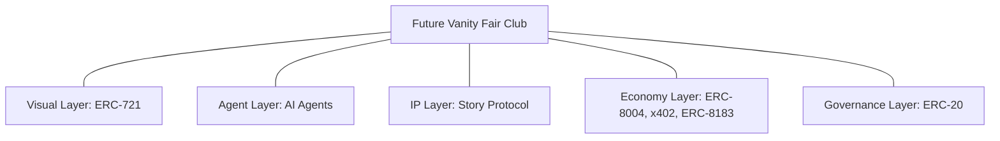

# Future Vanity Fair Club (FVFC)

Official public organization profile for **Future Vanity Fair Club (FVFC)**.

Future Vanity Fair Club is a cyber-luxury living IP economy where 10,000 unique Vani NFTs come to life in Future City, built with 881 hand-drawn attributes and 2,000+ algorithmic generation rules.

---

## 💎 About The Project

FVFC's long-term roadmap envisions an open Living IP economy where 10,000 Vani begin as ERC-721 visual identities and gradually evolve toward programmable personas, AI agents, IP licensing, and on-chain contribution proofs.

- **Collection Size**: 10,000 Unique F.NFTs
- **Artistic Foundation**: 881 Hand-drawn vector traits across multi-layer categories
- **Aesthetic DNA**: Future Glam (Cyber-Luxury Visual Language)
- **Smart Contract**: ERC-721 Drop with on-chain revenue distribution
- **Permanent Storage**: Filecoin Network & IPFS content addressing

---

## 🏛️ Infrastructure Roadmap

The website presents FVFC through five conceptual layers. The live mint covers Vani's Visual Layer as static ERC-721 artwork; programmable persona, agent, IP, economy, and governance layers are roadmap components that evolve with the ecosystem.

```mermaid
graph TD
    FVFC[Future Vanity Fair Club]
    FVFC --- A[Visual Layer: ERC-721]
    FVFC --- B[Agent Layer: AI Agents]
    FVFC --- C[IP Layer: Story Protocol]
    FVFC --- D[Economy Layer: ERC-8004, x402, ERC-8183]
    FVFC --- E[Governance Layer: ERC-20]
```

- **Visual Layer**: ERC-721. Vani's foundational art layer, built from 881 hand-drawn traits through algorithmic generation and human refinement.
- **Agent Layer**: AI agents. Autonomous personas and programmable talents empowering Vani to create, collaborate, and evolve.
- **IP Layer**: Story Protocol. Programmable creative rights, IP licensing, derivatives, and automated royalty flows.
- **Economy Layer**: ERC-8004, x402, and ERC-8183. Standards for identity, permissions, payments, coordination, creator contributions, and IP-based rewards.
- **Governance Layer**: ERC-20. The future token layer for value exchange, contributor incentives, and decentralized governance participation.

---

## 🧭 Official Navigation

All links are aligned with the official website navigation structure:

- **Home**: [https://futurevanityfairclub.com](https://futurevanityfairclub.com)
- **Collection**:
  - **IP**:
    - **Vani**: [https://futurevanityfairclub.com/vani](https://futurevanityfairclub.com/vani)
    - **Aesthetic**: [https://futurevanityfairclub.com/aesthetic](https://futurevanityfairclub.com/aesthetic)
  - **Development**:
    - **Craftsmanship**: [https://futurevanityfairclub.com/craftsmanship](https://futurevanityfairclub.com/craftsmanship)
    - **Technology**: [https://futurevanityfairclub.com/technology](https://futurevanityfairclub.com/technology)
    - **Traits**: [https://futurevanityfairclub.com/traits](https://futurevanityfairclub.com/traits)
- **Gallery**: [https://futurevanityfairclub.com/gallery](https://futurevanityfairclub.com/gallery)
- **License**: [https://futurevanityfairclub.com/license](https://futurevanityfairclub.com/license)
- **FAQ**: [https://futurevanityfairclub.com/faq](https://futurevanityfairclub.com/faq)
- **About FVFC**: [https://futurevanityfairclub.com/fvfc](https://futurevanityfairclub.com/fvfc)

---

## 🛒 Buy & Mint

- **Official Mint**: [https://futurevanityfairclub.com/mint](https://futurevanityfairclub.com/mint)
- **OpenSea**: [https://opensea.io](https://opensea.io)
- **Magic Eden**: [https://magiceden.io](https://magiceden.io)
- **Blur**: [https://blur.io](https://blur.io)

---

## 🌐 Official Socials & Communities

- **Feed**:
  - **X (Twitter)**: [@future_vanity](https://x.com/future_vanity)
  - **Bluesky**: [futurevanity.bsky.social](https://bsky.app/profile/futurevanity.bsky.social)
  - **Instagram**: [@future_vanity](https://www.instagram.com/future_vanity/)
  - **Threads**: [@future_vanity](https://www.threads.net/@future_vanity)
  - **Facebook**: [Future Vanity Fair Club](https://www.facebook.com/people/Future-Vanity-Fair-Club/61583735787299/)
- **Community**:
  - **Discord**: [Join Discord](https://discord.gg/Dwpk2vXpZD)
  - **Telegram**: [Join Telegram](https://t.me/FutureVanityFairClub)
  - **Reddit**: [r/futurevanityfairclub](https://www.reddit.com/r/futurevanityfairclub/)
- **Editorial**:
  - **Substack**: [futurevanity.substack.com](https://substack.com/@futurevanity)
  - **Pinterest**: [futurevanity](https://www.pinterest.com/futurevanity/)
  - **Medium**: [futurevanity](https://medium.com/@futurevanity)
- **Build**:
  - **GitHub**: [futurevanityfairclub](https://github.com/futurevanityfairclub)
- **Streams**:
  - **TikTok**: [@future_vanity](https://www.tiktok.com/@future_vanity)

---

## 📄 License & Proprietary Notice

All rights reserved © 2026 **Future Vanity Fair Club**.

This organization and repository provide official brand presence and ecosystem overviews. The core web application, proprietary art assets, and smart contract codebase remain confidential and proprietary. Unauthorized reproduction, modification, or commercial exploitation without permission is strictly prohibited.
