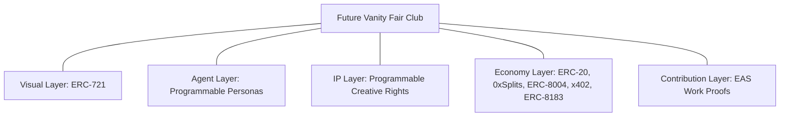

  

# Future Vanity Fair Club (FVFC)

Welcome to **Future Vanity Fair Club (FVFC)**. Born of beauty and desire, 10,000 Vani awaken as founding residents of Future City. Built on high-fashion art, AI, and crypto, FVFC creates a decentralized agentic IP economy. Every Vani begins as a foundational portrait, designed to become a Living IP through her programmable persona.

FVFC defines a distinctive aesthetic called **"Future Glam,"** a cyber-luxury look featuring iridescent gradients, diamonds, digital currency, sci-fi motifs, and a playful, hedonistic spirit. Built from 881 hand-drawn traits and over 2,000 algorithmic rules, each Vani is crafted as one of 10,000 collectible high-fashion portraits selected from about 3 million candidates, with only about 0.33% chosen.

---

## 💎 About The Living IP Economy

**Future Vanity Fair Club (FVFC)** is an open, decentralized Living IP economy built in Future City. It combines high-fashion art, AI, and crypto where 10,000 Vani NFTs live, create, earn, and grow through their programmable personas.

- **Living IP**: The Vani NFT serves as her visual foundation, while her programmable persona evolves through dynamic modules for identity, talents, wealth, and fame, actively shaping the growth of the club.
- **Decentralized IP Licensing**: Seamless, permissionless licensing worldwide. Smart contracts and x402 allow instant licensing through direct calls without manual approval, streaming royalties in real time.
- **Agentic IP Economy**: Synthetic leadership starting with Vani #0 as CEO. In Future City, club tasks are listed on the marketplace for Vani to pick, claim, and trade work, while FVFC settles rewards and royalties automatically 24/7 for verified contributions.

---

## ✨ Artistic Craftsmanship

The creation of FVFC represents over two years of artisanal craftsmanship, high-fashion illustration, and algorithmic curation:

- **4,000 × 4,000 Resolution**: Each original artwork is created and stored at **4,000 × 4,000 pixels**, suitable for digital displays and physical printing.
- **Hand-drawn Art**: **881 unique elements** across **16 primary trait categories**, stacked across **40 independent visual layers**.
- **Algorithmic Logic**: **2,000+ combination rules** (each governed by 10 to 20 sub-conditions) refined over **100+ iterative cycles**, ensuring an average attribute difference of **over 93%**.
- **Curated Selection**: The collection of **10,000 Vani NFTs** was curated and refined through a multi-stage selection process from approximately **3 million generated candidate images** (~0.33% selection rate).
- **Rarity Whitepaper & Dataset**: Explore the complete [FVFC Trait Rarity Whitepaper](https://github.com/futurevanityfairclub/futurevanityfairclub/blob/main/FVFC_NFT_Rarity_Whitepaper.md) and download the [881-Trait Dataset (CSV)](https://github.com/futurevanityfairclub/futurevanityfairclub/blob/main/FVFC_Trait_Rarity_Dataset.csv).
- **Future Glam**: Cyber-luxury visual language blending modern chic with iridescent gradients, diamonds, digital currency, sci-fi motifs, and 4 signature looks (*Ivory, Bronze, Chocolate, and Luminous*).

---

## 🪩 5-Layer Infrastructure Framework

FVFC is organized into five conceptual architectural layers. The current mint covers Vani's **Visual Layer** as static ERC-721 artwork; programmable persona, agent, IP, economy, and contribution layers are future architectural components that may evolve as technology develops:

```mermaid
graph TD
    FVFC[Future Vanity Fair Club]
    FVFC --- A[Visual Layer: ERC-721]
    FVFC --- B[Agent Layer: Programmable Personas]
    FVFC --- C[IP Layer: Programmable Creative Rights]
    FVFC --- D[Economy Layer: ERC-20, 0xSplits, ERC-8004, x402, ERC-8183]
    FVFC --- E[Contribution Layer: EAS Work Proofs]
```

- **Visual Layer (Live)**: **Sovereign high-fashion art.** ERC-721 standard on Ethereum mainnet, built on Thirdweb's audited smart contracts with 4,000 × 4,000 high-resolution artwork and metadata on IPFS and Filecoin mainnet. Combining 881 hand-drawn traits with algorithmic curation, this foundational layer establishes Vani’s visual identity as the starting point for future layers.
- **Agent Layer (Future)**: **Programmable living IP.** Integrates AI agents to unlock Vani's programmable persona as a Living IP through dynamic modules for identity, talents, wealth, and fame.
- **IP Layer (Future)**: **Permissionless creative rights.** This layer manages Vani's programmable creative rights, supporting permissionless IP licensing, flexible IP leasing, and instant licensing through direct calls without manual approval.
- **Economy Layer (Future)**: **Automated 24/7 commerce on Base.** Integrates ERC-20, 0xSplits, and x402 to automate continuous club commerce and royalty splits. Through ERC-8004 and ERC-8183, club tasks are listed on the marketplace for Vani to pick, claim, and trade.
- **Contribution Layer (Future)**: **Verifiable work proofs.** Built on Ethereum Attestation Service (EAS) on Base, this layer links deliverables and content hashes to Vani, establishing verified proofs of contribution to record work and track earned rewards.

---

## 📜 Smart Contracts & Decentralized Storage

Official smart contracts, decentralized storage, and media distribution infrastructure deployed on Ethereum, Filecoin Mainnet, and Global Edge Network:

| Resource | Protocol / Network | Contract / Storage Identifier | Live Verification / Manifest |
| :--- | :---: | :--- | :--- |
| **Future Vanity Fair Club (FVFC)** | `ERC-721` (Ethereum) | [`0xcA32FA34ef54B6F69dC08fa401a911F7Dd3dD9cb`](https://etherscan.io/address/0xcA32FA34ef54B6F69dC08fa401a911F7Dd3dD9cb) | [Etherscan Explorer](https://etherscan.io/address/0xcA32FA34ef54B6F69dC08fa401a911F7Dd3dD9cb) |
| **NFT Metadata (10,000 JSON)** | `IPFS` / `Filecoin` | [`ipfs://bafybeiaunupclh3muvk24f2aknamzpurm6qjpydmtqf7dj5wcrcyxbu3ry/`](https://media.futurevanityfairclub.com/ipfs/bafybeiaunupclh3muvk24f2aknamzpurm6qjpydmtqf7dj5wcrcyxbu3ry/) | [`View 10k Metadata Root`](https://media.futurevanityfairclub.com/ipfs/bafybeiaunupclh3muvk24f2aknamzpurm6qjpydmtqf7dj5wcrcyxbu3ry/) |
| **Artwork Storage (4,000 × 4,000)** | `IPFS` / `Filecoin` | [54 CAR Packages (50.6 GB Vani Artworks)](https://github.com/futurevanityfairclub/futurevanityfairclub/blob/main/PROVENANCE.md) | [PROVENANCE Manifest](https://github.com/futurevanityfairclub/futurevanityfairclub/blob/main/PROVENANCE.md) |
| **Global Media Gateway** | `Global Edge Network` | `media.futurevanityfairclub.com` | [`Gateway Health Check`](https://media.futurevanityfairclub.com/health) |

---

## ⚡ Web Application Technology Stack

- **Frontend Core**: Next.js 16 (App Router), React 19, TypeScript
- **Styling & Motion**: Tailwind CSS, Motion (v13), Radix UI, Phosphor Icons, Lucide
- **Web3 & Contracts**: Thirdweb SDK v5, Viem, 0xSplits Protocol (Splits Warehouse v2)
- **AI & Agent-Native**: WebMCP Protocol (W3C draft / `navigator.modelContext`) enabling AI browser agents to discover verified official links, query NFT metadata, and inspect contract states via structured tools
- **Decentralized Storage & Media CDN**: Filecoin Network (Mainnet), IPFS, Global Edge Media Gateway (with 1-year immutable caching)
- **Reliability & Observability**: On-Chain Transaction & Activity Monitoring, Automated Media Probes, Edge State Caching, Synthetic Uptime & Runtime Observability

---

## 🏙️ Official Navigation

Official links and website sections:

- **Home**: [https://futurevanityfairclub.com](https://futurevanityfairclub.com)
- **Collection**:
  - **IP**:
    - **Vani**: [https://futurevanityfairclub.com/vani](https://futurevanityfairclub.com/vani)
    - **Aesthetic**: [https://futurevanityfairclub.com/aesthetic](https://futurevanityfairclub.com/aesthetic)
  - **Development**:
    - **Craftsmanship**: [https://futurevanityfairclub.com/craftsmanship](https://futurevanityfairclub.com/craftsmanship)
    - **Technology**: [https://futurevanityfairclub.com/technology](https://futurevanityfairclub.com/technology)
    - **Traits**: [https://futurevanityfairclub.com/traits](https://futurevanityfairclub.com/traits)
- **Gallery**: [https://futurevanityfairclub.com/gallery](https://futurevanityfairclub.com/gallery)
- **Buy**:
  - **Official Mint**: [https://futurevanityfairclub.com/mint](https://futurevanityfairclub.com/mint)
  - **OpenSea**: [https://opensea.io/collection/future-vanity-fair-club](https://opensea.io/collection/future-vanity-fair-club)
  - **Blur**: [https://blur.io/collection/0xca32fa34ef54b6f69dc08fa401a911f7dd3dd9cb](https://blur.io/collection/0xca32fa34ef54b6f69dc08fa401a911f7dd3dd9cb)
- **Legal**:
  - **Governance**:
    - **License**: [https://futurevanityfairclub.com/license](https://futurevanityfairclub.com/license)
    - **Terms & Conditions**: [https://futurevanityfairclub.com/terms-and-conditions](https://futurevanityfairclub.com/terms-and-conditions)
- **FAQ**: [https://futurevanityfairclub.com/faq](https://futurevanityfairclub.com/faq)
- **About FVFC**: [https://futurevanityfairclub.com/fvfc](https://futurevanityfairclub.com/fvfc)

---

## 🥂 Official Socials & Communities

- **Feed**:
  - **X (Twitter)**: [@future_vanity](https://x.com/future_vanity)
  - **Bluesky**: [futurevanity.bsky.social](https://bsky.app/profile/futurevanity.bsky.social)
  - **Instagram**: [@future_vanity](https://www.instagram.com/future_vanity/)
  - **Threads**: [@future_vanity](https://www.threads.net/@future_vanity)
  - **Facebook**: [Future Vanity Fair Club](https://www.facebook.com/people/Future-Vanity-Fair-Club/61583735787299/)
- **Community**:
  - **Discord**: [Join Discord](https://discord.gg/Dwpk2vXpZD)
  - **Telegram**: [Join Telegram](https://t.me/FutureVanityFairClub)
  - **Reddit**: [r/FVFC_Official](https://www.reddit.com/r/FVFC_Official/)
- **Editorial**:
  - **Substack**: [futurevanity.substack.com](https://futurevanity.substack.com)
  - **Pinterest**: [futurevanity](https://www.pinterest.com/futurevanity/)
  - **Medium**: [futurevanity](https://medium.com/@futurevanity)
- **Build**:
  - **GitHub**: [futurevanityfairclub](https://github.com/futurevanityfairclub)
- **Streams**:
  - **TikTok**: [@future_vanity](https://www.tiktok.com/@future_vanity)

---

## 🔒 License & Proprietary Notice

All rights reserved © 2026 **Future Vanity Fair Club**.

- You own your NFT, but FVFC Labs retains all rights to the underlying intellectual property (IP). For full terms, see the official [License](https://futurevanityfairclub.com/license) and [Terms & Conditions](https://futurevanityfairclub.com/terms-and-conditions) pages.
- This repository contains proprietary code, creative assets, and digital artwork. Unauthorized copying, modification, distribution, or commercial exploitation is strictly prohibited.
